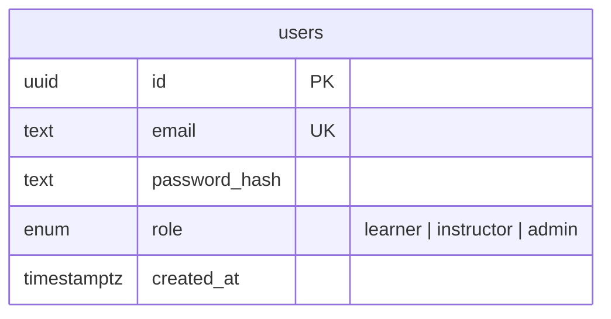

# Data Model — Ascent

How data is designed across the system. In a microservices architecture there is
**no single shared database and no cross-service foreign keys** — each service owns
its own schema. Services reference each other only by **ID** (a soft reference, not
a DB constraint), and stay consistent through **events**, not joins.

Design rule going forward: a service's data model is designed and added here
**before** its tables are coded.

---

## Ownership at a glance

| Service | Store | Owns |
| --- | --- | --- |
| Auth | Postgres `auth` + Mongo `auth_activity` | users/identity; activity log |
| Content | Postgres `content` | programs, courses, modules, lessons |
| Cohort | Postgres `cohort` | cohorts, enrollments |
| Progress | Postgres `progress` | per-learner enrollment projection |

Conventions: `uuid` primary keys (`gen_random_uuid()`), `snake_case` columns,
`timestamptz` timestamps (`created_at` defaults to now).

---

## Auth (Postgres)



Mongo `activities` (append-only log): `{ type, userId?, email?, ip?, at }`.

## Content (Postgres) — the curriculum hierarchy

```mermaid
erDiagram
  programs ||--o{ courses : has
  courses  ||--o{ modules : has
  modules  ||--o{ lessons : has
  programs { uuid id PK; text title; text description; bool published; uuid created_by; timestamptz created_at }
  courses  { uuid id PK; uuid program_id FK; text title; int position; bool published; uuid created_by }
  modules  { uuid id PK; uuid course_id FK; text title; int position }
  lessons  { uuid id PK; uuid module_id FK; enum type; text content; int position }
```

Foreign keys **within** Content cascade on delete (deleting a program removes its
courses, modules, lessons).

## Cohort (Postgres)

```mermaid
erDiagram
  cohorts ||--o{ enrollments : has
  cohorts     { uuid id PK; uuid program_id "ref Content"; text title; timestamptz start_date; int seat_limit; int seats_taken; uuid created_by }
  enrollments { uuid id PK; uuid cohort_id FK; uuid user_id "ref Auth"; timestamptz enrolled_at }
  outbox      { uuid id PK; text topic; text key; jsonb payload; timestamptz created_at; timestamptz published_at }
```

`enrollments` has a unique `(cohort_id, user_id)` — a learner enrolls once. Seats
are protected by the atomic conditional update (see ARCHITECTURE section 6).

`outbox` implements the **Transactional Outbox**: the event is written in the same
transaction as the enrollment, so business data and event commit together. A relay
publishes unpublished rows to Kafka and stamps `published_at`; on a crash it
republishes (at-least-once), and consumers dedup by `eventId`.

## Progress (Postgres) — an event-built projection

```mermaid
erDiagram
  learner_cohorts  { uuid id PK; uuid user_id "ref Auth"; uuid cohort_id "ref Cohort"; uuid program_id "ref Content"; timestamptz enrolled_at }
  processed_events { uuid event_id PK; timestamptz processed_at }
```

Progress owns **no source data**; `learner_cohorts` is a projection built by
consuming events. `processed_events` gives the consumer idempotency (an event id
seen twice is ignored). Unique `(user_id, cohort_id)`.

---

## Cross-service references (soft, ID-only, no FK)

| From | Column | Points at |
| --- | --- | --- |
| Content.programs / courses | `created_by` | Auth.users.id |
| Cohort.cohorts | `program_id` | Content.programs.id |
| Cohort.cohorts | `created_by` | Auth.users.id |
| Cohort.enrollments | `user_id` | Auth.users.id |
| Progress.learner_cohorts | `user_id`, `cohort_id`, `program_id` | Auth / Cohort / Content |

These are not enforced by the database. Referential integrity across services is a
runtime concern, handled by application logic and events, not constraints.

## Events that connect the models

| Event (topic) | Producer | Consumer(s) | Payload |
| --- | --- | --- | --- |
| `learner.enrolled` | Cohort | Progress (+ future Gamification, Notification) | `enrollmentId, cohortId, userId, programId, seatsRemaining` |

Planned: `lesson.completed` (Content -> Progress), `submission.judged`
(Judge -> Progress/Gamification/Notification). Every event carries the standard
envelope (`eventId, eventType, version, occurredAt, correlationId, producer,
payload`).
